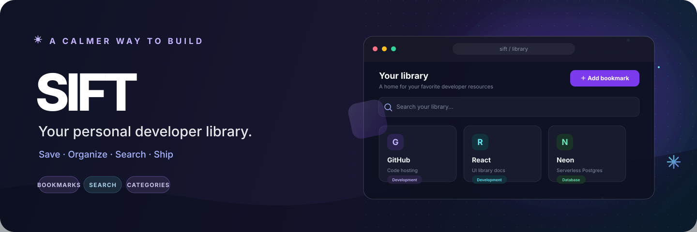
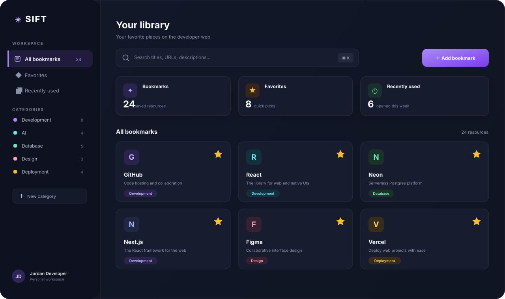

<div align="center">
  
  <br />
  <p><strong>YOUR PERSONAL DEVELOPER LIBRARY</strong></p>
  <p><em>Save. Organize. Search. Ship.</em></p>
  <p>A beautiful home for the websites, tools, docs, and resources you use every day.</p>
  <br />
  <a href="https://sift-bookmarks.vercel.app/"></a>
  <br /><br />
  
  
  
  
  
</div>

---

## Overview

The developer web is full of useful places to visit—and it's easy to lose them in tabs, scattered bookmarks, and half-remembered URLs. **Sift brings your everyday developer resources together in one personal, searchable library.**

Keep the tools you rely on close, group them around the way you work, and get back to building without the hunt.

> **Less searching. Less remembering. More building.**

## The workspace

<div align="center">
  
  <sub>Illustrative dashboard artwork created for this README.</sub>
</div>

## Features

|  | Feature | What it does |
|:--:|---|---|
| 🔖 | **Bookmarks** | Save useful websites with a title, URL, and description. |
| 🗂️ | **Categories** | Make categories that match your workflow—Development, AI, Design, Databases, and more. |
| ⭐ | **Favorites** | Pin the resources you reach for most often. |
| 🔎 | **Search** | Search across bookmark titles, URLs, descriptions, and categories. |
| ⌘ | **Command palette** | Press **⌘ K** or **Ctrl K** to find a resource without leaving the keyboard. |
| 🕐 | **Recently used** | Get back to resources you've opened lately. |
| 🔐 | **Personal workspace** | Keep each account's library associated with its own workspace. |
| ✨ | **Suggestions** | Browse popular resources and add only the ones you actually want. |

### Your library, your choices

New users can start from popular suggestions—GitHub, MDN, React, Vercel, Neon, npm, and more. **Suggestions are never added automatically.** You choose what belongs in your library.

## Built around your workflow

`mermaid
flowchart LR
    A[Your library] --> B[Development]
    A --> C[AI]
    A --> D[Databases]
    A --> E[Design]
    A --> F[Deployment]
    A --> G[Tools]
    B --> B1[GitHub]
    B --> B2[React]
    B --> B3[Next.js]
    C --> C1[ChatGPT]
    C --> C2[Claude]
    D --> D1[Neon]
    D --> D2[Supabase]
    E --> E1[Figma]
    E --> E2[Dribbble]
    classDef library fill:#19172f,stroke:#a78bfa,color:#fff,stroke-width:2px;
    classDef category fill:#171f35,stroke:#526183,color:#e7e9f5;
    class A library;
    class B,C,D,E,F,G,B1,B2,B3,C1,C2,D1,D2,E1,E2 category;
``

Create categories, rename them, and organize your library around the way *you* build.

## Find it fast

Search the whole library by **title, URL, description, or category**. Open the command palette with **⌘ K** on macOS or **Ctrl K** on Windows and Linux.

``text
┌─────────────────────────────────────────────────────────┐
│  ⌕  Search your library...                         ⌘ K  │
├─────────────────────────────────────────────────────────┤
│  ◉  GitHub                                               │
│     github.com                                           │
│                                                         │
│  ◉  React                                                │
│     react.dev                                            │
└─────────────────────────────────────────────────────────┘
`

## Private by design

Sift is built around **personal workspaces**. Authentication connects a user to their library, and bookmarks, categories, favorites, and recent activity belong to that user's workspace.

Sign in with email or Google (when Google OAuth is configured), then build a library that's yours.

## Architecture

``mermaid
flowchart LR
    UI[Next.js + React] --> AUTH[Authentication]
    UI --> ACTIONS[Server Actions]
    ACTIONS --> ORM[Drizzle ORM]
    ORM --> DB[(Neon PostgreSQL)]
    UI --> MOTION[Motion]
    UI --> COMPONENTS[Tailwind + UI components]
    classDef app fill:#17152d,stroke:#8b5cf6,color:#fff;
    classDef service fill:#14263a,stroke:#38bdf8,color:#e8f7ff;
    classDef data fill:#102d2b,stroke:#34d399,color:#e9fff6;
    class UI app;
    class AUTH,ACTIONS,ORM,MOTION,COMPONENTS service;
    class DB data;
`

### Data model

``mermaid
erDiagram
    USER ||--o{ BOOKMARK : owns
    USER ||--o{ CATEGORY : creates
    USER ||--|| USER_SETTINGS : has
    CATEGORY ||--o{ BOOKMARK : groups
    BOOKMARK ||--o{ RECENTLY_USED : appears_in
    USER {
        string id
        string email
        string name
        string image
    }
    CATEGORY {
        string id
        string user_id
        string name
        string icon
        string color
    }
    BOOKMARK {
        string id
        string user_id
        string category_id
        string title
        string url
        string description
        boolean is_favorite
        datetime last_opened_at
    }
    RECENTLY_USED {
        string id
        string bookmark_id
        datetime opened_at
    }
    USER_SETTINGS {
        string id
        string user_id
        string theme
        boolean sidebar_collapsed
    }
`

## Tech stack

<div align="center">

| Layer | Tools |
|---|---|
| **Frontend** | Next.js · React · TypeScript |
| **UI** | Tailwind CSS · Motion · UI components |
| **Backend** | Server Actions · Drizzle ORM |
| **Database** | PostgreSQL · Neon |
| **Deployment** | Vercel |

</div>

## Get started

### Prerequisites

- Node.js and npm
- A PostgreSQL database (for example, a Neon project)
- Google OAuth credentials if you want to enable Google sign-in

### 1. Clone the repository

Replace the placeholders with your GitHub username and repository name:

```bash
git clone https://github.com/YOUR_USERNAME/YOUR_REPOSITORY.git
cd YOUR_REPOSITORY
```

### 2. Install dependencies

```bash
npm install
```

### 3. Configure environment variables

Create a `.env.local` file in the project root:

``env
DATABASE_URL="your-neon-database-url"
AUTH_SECRET="your-long-random-secret"
GOOGLE_CLIENT_ID="your-google-client-id"
GOOGLE_CLIENT_SECRET="your-google-client-secret"
NEXT_PUBLIC_APP_URL="http://localhost:3000"

For a secure `AUTH_SECRET`, you can generate a random value with:

``bash
openssl rand -base64 32
`
### 4. Run the app

```bash
npm run dev
```

Open [http://localhost:3000](http://localhost:3000) in your browser.

## Roadmap

### Sift browser extension

The next step toward a one-click save workflow:

- Save the current page to Sift
- Choose a category before saving
- Quick-add from the browser toolbar
- Add Sift from a right-click context menu
- Sync saved pages with your library

**Any website → Save → Your Sift library.**

## Project vision

```text
Bookmarks  →  Personal library  →  Developer workspace  →  Browser extension
                                                                      ↓
                                                     Your developer command center
```

Sift isn't trying to replace your browser. It makes **the web you use every day easier to access**.

---

<div align="center">
  <h2>✦ SIFT</h2>
  <p><strong>Your personal developer library.</strong></p>
  <p>Save your tools. Find them in seconds. Get back to building.</p>
  <a href="https://sift-bookmarks.vercel.app/"></a>
  <br /><br />
  <sub>If Sift is useful to you, consider giving the project a star ⭐</sub>
</div>
